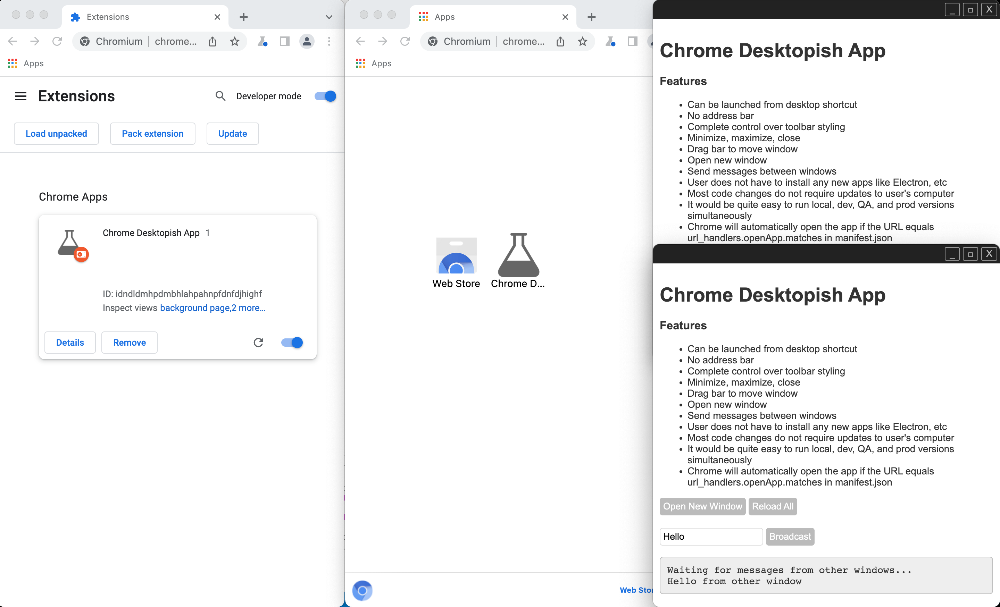

# Chrome Desktopish App

Proof of concept that you can make a Chrome App with your own custom toolbar, minimize, maximize, and close buttons


**Features**
- Desktop-like app
- Most of the code (e.g. child-webpage directory) would not require the user to run an update
- Customized toolbar + buttons
- Minimize, maximize, close, open new window
- User can move the window by clicking and dragging the toolbar
- Interwindow communication


## Requirements
- Node v16+
- Chrome says it will discontinue Chrome Apps June 2022. This was tested on Chrome v101 and Chromium v101 in May 2022


## Set Up
- Run
  ```
  cd child-webpage
  npm i
- In Chrome or Chromium go to More Tools > Extensions
- Click the "Devloper mode" toggle
- Click the "Load unpackaged" button 
- Navigate to and choose the parent-chrome-app directory


## Run 
- Run
  ```
  cd child-webpage
  npm start
- Go to `chrome://apps/`
- Click the "Chrome Desktopish App" to launch it


## Understanding the Code
- Chrome uses manifest.json when installing the Chrome App
- When the Chrome App is launched, parent-chrome-app/background.js launches parent-chrome-app/index.html
- which iframes http://localhost:3000/index.html (child-webpage)
- After the iframe loads, parent.js sends a postMessage to the child
- From the postMessage's event.source, child.js now has a reference to the parent window and can send it messages
- Messages between parent and child are sent with postMessage() and received with addEventListener('message')
- Messages between Chrome App windows are sent with chrome.runtime.sendMessage() and received with chrome.runtime.onMessage.addListener()

- Example 1: Minimize 
  - User clicks the minimize button (or maximize, close, or open new window) in the child window
  - Child sends postMessage to parent
  - Parent receives message
  - Parent runs the command to minimize the Chrome App window

- Example 2: Broadcast Message
  - User types a message and clicks "Broadcast" in the child window
  - Child sends postMessage to parent
  - Parent receives message
  - Parent sends message to other Chrome App windows
  - Other Chrome App windows receive the message
  - They then send postMessage to their child iframes
  - Child iframes receive message and output it the HTML


## Screenshot

